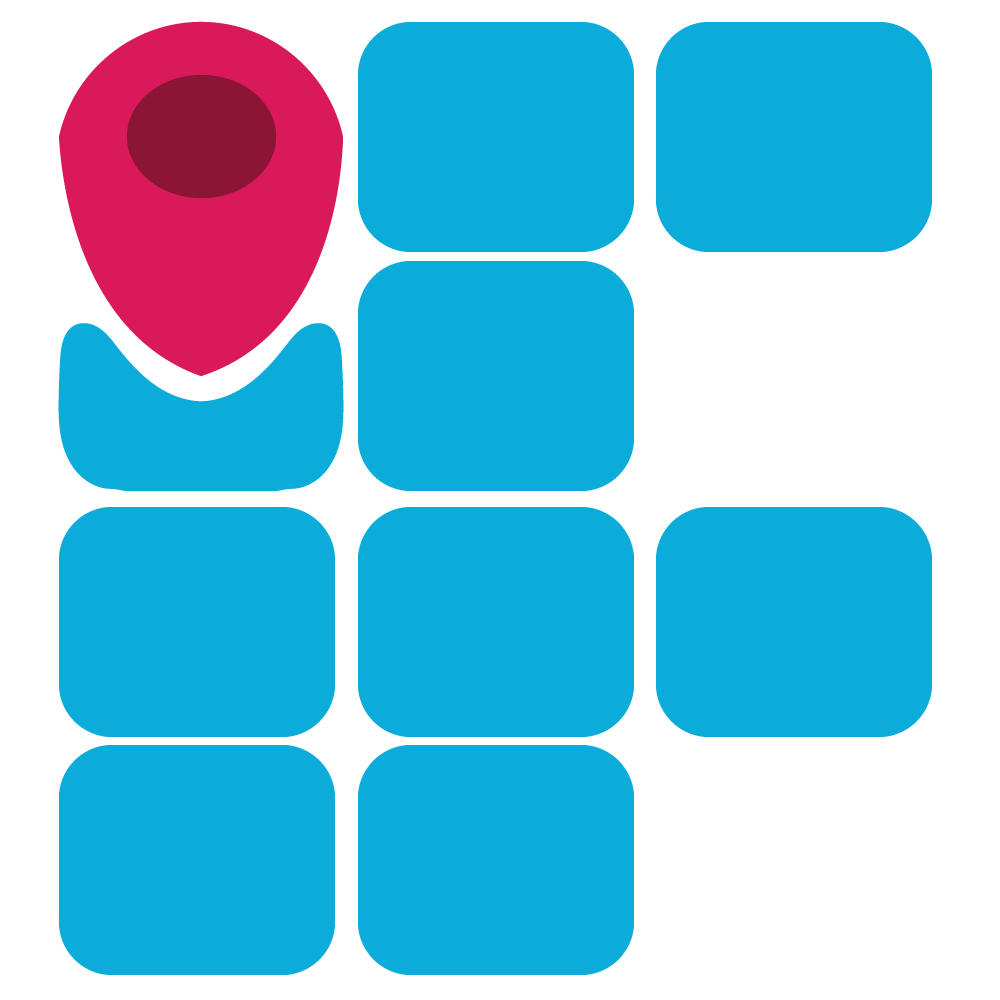

# IFIND - Wayfinder IFBA Campus Jacobina

Bem-vindo ao repositório do projeto IFIND! Esta é uma aplicação web desenvolvida para ajudar as pessoas a navegar pelo campus do Instituto Federal da Bahia (IFBA) em Jacobina. O objetivo dessa aplicação é enfrentar os problemas de wayfinding, fornecendo orientações precisas e atualizadas para estudantes, visitantes e funcionários. Ela foi concebida como parte do trabalho de conclusão do curso técnico em Informática da instituição. 

## Sobre o Projeto

O IFIND é uma solução para melhorar a experiência de navegação dentro do campus do IFBA em Jacobina. Muitas vezes, estudantes, visitantes e funcionários enfrentam dificuldades para encontrar salas de aula, laboratórios, escritórios administrativos e outros locais importantes. Nosso objetivo é fornecer uma aplicação web intuitiva e fácil de usar que ofereça orientações precisas para diferentes destinos no campus.

## Recursos Principais

- Interface intuitiva e amigável.
- Horários de aula para cada turma.
- Notícias e informações sobre eventos no campus.
- Mapa interativo do campus com pontos de interesse marcados.
- Informações adicionais sobre cada local, como horários de funcionamento e contatos.

## Tecnologias Utilizadas

O projeto IFIND - Wayfinder IFBA Campus Jacobina utiliza as seguintes tecnologias:

- **Python** (v3.10.2)
- **Flask** (v2.2.3)
- **Flask-Bcrypt** (v1.0.1)
- **Flask-Login** (v0.6.2)
- **flask-ngrok** (v0.0.25)
- **Jinja2** (v3.1.2)
- **Werkzeug** (v2.2.3)
- **SQLite** (v3)

## Como Contribuir

Se você deseja contribuir para o desenvolvimento do IFIND - Wayfinder IFBA Campus Jacobina, siga as etapas abaixo:

1. Faça um fork deste repositório.
2. Clone o seu fork para a sua máquina local.
3. Crie um novo branch com uma descrição clara da sua contribuição: `git checkout -b minha-contribuicao`.
4. Implemente suas alterações e faça os devidos testes.
5. Commit suas alterações: `git commit -m "Minha contribuição: descrição"`.
6. Faça push para o branch: `git push origin minha-contribuicao`.
7. Abra um Pull Request neste repositório.

## Equipe de Desenvolvimento

- Gabriel Levi - Estudante do curso Técnico em Informática pelo IFBA Campus Jacobina
- Idelson Mendes - Estudante do curso Técnico em Informática pelo IFBA Campus Jacobina
- Ciro Sobral - Professor do curso Técnico em Informática pelo IFBA Campus Jacobina

## Licença

Este projeto está licenciado sob a licença [MIT](LICENSE). Sinta-se à vontade para utilizar, modificar e distribuir o código conforme necessário.

## Contato

Se você tiver alguma dúvida, sugestão ou feedback, abra uma issue aqui no Github:

- Issues: [Link para as issues](../../issues)
